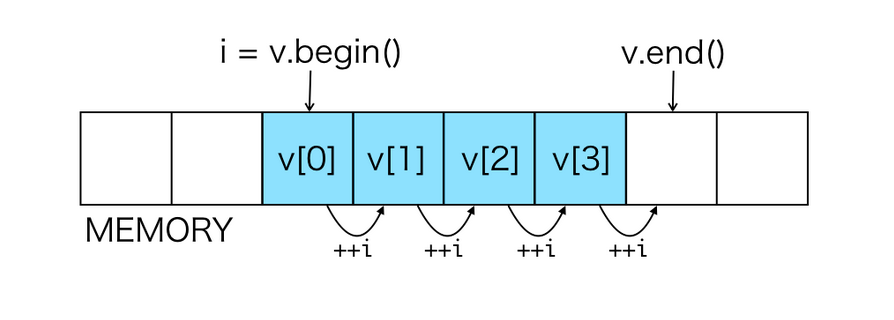

## Dizi(Array)




Dizi veri yapısı, bilgisayar bilimlerindeki en yaygın veri yapılarından biridir. Dizi yapısı, aynı türdeki sabit sayıda öğenin ardışık olarak bellekte tutulmasıyla oluşturulur. Dizi yapısının önemli özelliklerinden biri, rastgele erişim sağlayabilme kabiliyetidir. Bu özellik, herhangi bir öğeye doğrudan erişim sağlayabilme imkanı sunar. Bu sayede dizi yapısında bir öğeye erişmek için her zaman maliyeti $O(1)$`dir.

Dizi yapısının bir diğer avantajı ise, bağlı listedeki işaretçilere ihtiyaç duymamasıdır. Bağlı listede her eleman, sonraki elemanın konumunu işaret eden bir işaretçi kullanılarak depolanır. Bu durum, bellek kullanımını artırabilir ve performansı etkileyebilir. Ancak, dizi yapısında her eleman, bellekte sıralı bir şekilde depolanır ve işaretçilere ihtiyaç duyulmaz. Bu nedenle, bellek kullanımı daha verimli hale gelir ve performans daha yüksek olur.

Tabi bu faydaları sağlayabilmenin yolu dizinin büyüklüğünü biliyor olmamızdır. Bu dizinin sabit boyutlu lduğu anlamına gelir. Bu dezavantajı, kopyalama ve yeniden boyutlandırma maliyeti karşılığında ekarte etmek mümkündür. Bunun yolu dinamik dizilerdir([Vector](/vector)). 

| İşlev    | Big O    |
| -------- | -------- |
| Atama    | $O(1)$   |
| Takas    | $O(1)$   |
| Arama    | $O(n)$   |
| Dolgu    | $O(n)$   |
| Boyut    | $O(1)$   |
| Sıralama | $O(n^2)$ |

#### Sınıf Yapısı

Dizilerin gerçeklenmesinde C++11 standartları ile dile eklenen [unique_ptr](https://en.cppreference.com/w/cpp/memory/unique_ptr) aracı kullanılmıştır. Bu araç, kaynak yönetimi için daha güvenli bir yol sağlar. unique_ptr ile oluşturulan nesneler, kaynağı kapsayan nesne yok olduğunda otomatik olarak serbest bırakılır. Bu sayede, kaynaklar elle serbest bırakılmadan da yönetilebilir. unique_ptr, özellikle dinamik bellek yönetiminde kullanılan ve kaynak sızıntılarını önlemeye yardımcı olan bir araçtır.

```cpp
template <typename T, std::size_t N>
class Array {
 private:
  std::unique_ptr<T[]> data;

 public:
  Array();
  Array(const Array &obj);
  Array(std::initializer_list<T> init);
  Array &operator=(const Array &obj);
  bool operator==(const Array &rhs);
  bool operator!=(const Array &rhs);

  [[nodiscard]] T &operator[](size_t index);
  [[nodiscard]] const T &operator[](size_t index) const;

  std::size_t size() const;
  [[nodiscard]] T &begin() const;
  [[nodiscard]] T &end() const;
  const bool empty() const;
  void fill(T fill_value);
  void fill(T &first, T &last, T fiil_value);
  void swap(T &first, T &last);
  void sort();
  T *search(T value) const;
};
```

---

#### Kurucu

```cpp
// Varsayılan(Default) Kurucu
template <typename T, std::size_t N>
Array<T, N>::Array() : data(new T[N]) {}

// Kopya(Copy) Kurucu
template <typename T, std::size_t N>
Array<T, N>::Array(const Array &obj) : data(new T[N]) {
  for (std::size_t i = 0; i < N; i++) {
    this->data[i] = obj.data[i];
  }
}

//Liste Başlatıcı
template <typename T, std::size_t N>
Array<T, N>::Array(std::initializer_list<T> init_list) : data(new T[N]) {
  size_t i = 0;
  for (auto &item : init_list) {
    data[i] = item;
    i++;
    if (i == N) break;
  }
}

// Kopya Atama 
template <typename T, std::size_t N>
Array<T, N> &Array<T, N>::operator=(const Array &obj) {
  if(this == &obj) {return *this;}
  std::copy(obj.data.get(), obj.data.get() + N, this->data.get());
  return *this;
}
```


---

##### Atama ve Silme İşlemleri Hakkında

Dizilerde atama ve silme işlemleri esasında kapasite üzerinde değişiklik yapmaz. Silme işlemi sırasında silinmek istenen index üzerine sağdaki indexler taşınır ve KULLANILABİLİR boyut bir azaltılır. Tam tersi olarak ekleme işlemi de eğer yeterli kapasite varsa, KULLANILABİLİR boyut bir artılır. Örn:

```cpp
// data >> {1,2,3,4,5,6,7,8,9}
// data kapasite = 8;
// data boyut = 8; !!!

data.remove(5/*index*/);

// data >> {1,2,3,4,5,7,8,9};
// data kapasite = 8;
// data boyut = 7; !!!
```

Tabi bu senaryo dizi veri yapısında işlenmedi. Kaynaklar genellikle Dizi(Array) ve Dinamik Dizi`yi(Vector) birlikte gösterme eğilimde ama iki yapı bir birinden farklıdır. Dizi yapısında boyut her zaman sabittir. Dinamik dizi(Vector) belgenin devamında ayrıca ele alındı.

---

#### Sıralama

Bu kod, Array sınıfı için sıralama işlemi gerçekleştirmek üzere [Seçmeli Sıralama](https://tr.wikipedia.org/wiki/Se%C3%A7meli_s%C4%B1ralama)(Selection Sort) algoritmasını kullanır. Bu algoritma, belirli bir veri kümesi içindeki en büyük/küçük öğeyi bulmak için sırayla tüm öğeleri tarar ve sonunda bu öğeyi ilk konuma taşır. Ardından, en büyük/küçük ikinci öğeyi bulmak için ikinci geçiş yapılır ve işlem veri kümesinin tamamı sıralanana kadar tekrarlanır.

Bu algoritmanın gerçeklenmesi oldukça basittir ve düşük bellek kullanımı gerektirir, ancak büyük veri setleri için verimsiz olabilir. Küçük veri setleri için ise oldukça verimli olarak çalışır. Bu nedenle, sabit boyutlu olan dizi veri yapısı için bu sıralama algoritması tercih edilebilir bir seçenek olabilir.

```cpp
template <typename T, std::size_t N>
void Array<T, N>::sort() {
  std::size_t index;
  for (size_t i = 0; i < size() - 1; i++) {
    index = i;
    for (size_t j = i; j < size(); j++) {
      if (data[index] < data[j]) index = j;
    }
    std::swap(data[i], data[index]);
  }
}
```

<h4 align="center"><a href="/linked_list/circular_linked_list" >< Önceki Sayfa | <a href="/vector">Sonraki Sayfa ></a></a></h4>