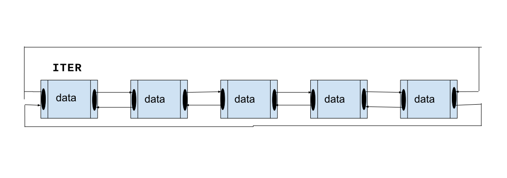

## Dairesel Bağlantılı Liste(Circular Linked List)

Dairesel biçimde düzenlenmiş bir grup düğümden oluşan veri yapısıdır. Her düğüm, bir veri öğesi, bir sonraki düğüme ve önceki işaretçi içerir(Tek yönlü de olabilir). Dairesel bağlantılı listede, son düğüm ilk düğüme bağlanarak bir döngü oluşturur.



#### Düğüm Yapısı

```cpp
template <typename T>
struct Node {
  Node<T> *next;
  Node<T> *prev;
  T data;

Node(T _data) : data(_data), next(nullptr), prev(nullptr) {}
};
```

#### Çift Yönlü Bağlantılı Liste Sınıfı
Bu sınıf, düğümlerin yönetimini üstlenir ve sadece *iter şaret düğümü barındırır. Tek yönlü bağlı liste ve çift yönlü bağlı liste ile farkı bir baş veya kuyruk yoktur.
Sınıfın üye fonksiyonları şunlardır:

| İşlev                      | Big O  |
| -------------------------- | ------ |
| Ekleme                     | $O(1)$ |
| Ekleme(Düğüm)              | $O(1)$ |
| Silme                      | $O(1)$ |
| Silme(Değer)               | $O(n)$ |
| Silme(Düğüm)               | $O(n)$ |
| Listeyi Temizleme          | $O(n)$ |
| Arama                      | $O(n)$ |
| Büyüklük                   | $O(n)$ |
| Listedeki Koparma          | $O(n)$ |
| Birleştirme                | $O(1)$ |
| Listedeki Eleman Sayısı    | $O(n)$ |
| Dairesel Bağlantı Kontrolü | $O(n)$ |
| Liste Görüntüleme          | $O(n)$ |

---

```cpp
template <typename T>
class CircularLinkedList {
 public:
  CircularLinkedList();
  CircularLinkedList(T init_first_node);
  
  void display();
  void add(const T _data);
  void add(Node<T> *_node);
  bool remove();
  bool remove(Node<T> *delenda);
  bool remove(const T delenda);
  Node<T> *find(const T _data);
  [[nodiscard]] Node<T> *detach_from_list(Node<T> *_node);
  void move_list_to_list(CircularLinkedList<T> &list);
  void clear();
  bool check_circular();
  std::size_t size();
  
  ~CircularLinkedList();

 private:
  Node<T> *iter;
};
```

#### Ekleme

Ekleme işlevinin 2 ayrı yüklemesi vardır. Yeni element, hemen iterin bir sonrasına eklenir.

```cpp
template <typename T>
void CircularLinkedList<T>::add(const T _data) {
  
  Node<T> *temp = new Node<T>(_data);
  if (iter == nullptr) {
    iter = temp;
    iter->next = iter;
    iter->prev = iter;
  } else if (iter->next == nullptr) {
    iter->next = temp;
    iter->prev = temp;
    temp->next = iter;
    temp->prev = iter;
  } else {
    Node<T> *next_temp = iter->next;
    iter->next = temp;
    temp->prev = iter;
    temp->next = next_temp;
    next_temp->prev = temp;
  }
}

template <typename T>
void CircularLinkedList<T>::add(Node<T> *_node) {
  if (!_node) return;
  
  if (iter == nullptr) {
    iter = _node;
    iter->next = iter;
    iter->prev = iter;
  } else if (iter->next == nullptr) {
    iter->next = _node;
    iter->prev = _node;
    _node->next = iter;
    _node->prev = iter;
  } else {
    Node<T> *next_temp = iter->next;
    iter->next = _node;
    _node->prev = iter;
    _node->next = next_temp;
    next_temp->prev = _node;
  }
}
```

---

#### Silme

Silme işlevinin 3 ayrı yüklemesi vardır. Herhangi bir parametre almadığında iter listeden kaldırılır bu karmaşıklığın O(1) olamsını sağlar, argüman aldığı taktirde önce listede kaldırılacak düğümü bulacağından karmaşıklık O(n) olacağı anlamına gelir.

```cpp
template <typename T>
bool CircularLinkedList<T>::remove() {
  if (iter == nullptr) {
    return false;
  } else if (iter == iter->next) {
    delete iter;
    iter = nullptr;
  } else {
    Node<T> *temp = iter->next->next;
    delete iter->next;
    iter->next = temp;
    temp->prev = iter;
  }
  return true;
}


template <typename T>
bool CircularLinkedList<T>::remove(Node<T> *delenda) {
  if (!iter) return false;
  Node<T> *cmp_loop_end = iter->prev;
  do {
    if (iter == delenda) {
      Node<T> *temp = iter->next;
      iter = iter->prev;
      delete iter->next;
      iter->next = temp;
      temp->prev = iter;
      break;
    }

    iter = iter->next;
  } while (iter != cmp_loop_end);
  return true;
}

template <typename T>
bool CircularLinkedList<T>::remove(const T delenda) {
  if (!iter) return false;

  Node<T> *cmp_loop_end = iter->prev;

  do {
    if (iter->data == delenda) {
      Node<T> *temp = iter->next;
      iter = iter->prev;
      delete iter->next;
      iter->next = temp;
      temp->prev = iter;
      break;
    }

    iter = iter->next;
  } while (iter != cmp_loop_end);
  return true;
}
```

---

#### Koparma

Bağlı listenin belirli bir düğümü silmeden, bağlı listeden çıkarmanıza olanak tanır. Düğüm bağlı listeden ayrılırken, bağlantıları düzgün bir şekilde güncellemek için gereken işlemleri yapar. Üzerinde işlem yapıldıktan sonra listeden kaldırmak istenenlen düğümler için kullanışlı bir senaryodur. Listeden ayrılan düğüm kullanıcı tarafından silinmelidir. Aksi halde bellek sızıntısına sebep olur.

```cpp
template <typename T>
[[nodiscard]] Node<T> *CircularLinkedList<T>::detach_from_list(Node<T> *_node) {
  if (!_node || !iter) return nullptr;

  Node<T> *cmp_loop_end = iter;
  Node<T> *detach = nullptr;
  do {
    if (iter == _node) detach = _node;
    iter = iter->next;
  } while (iter != cmp_loop_end);

  if (!detach) {
  } else if (iter->next == nullptr) {
    detach = _node;
    iter = nullptr;
  } else {
    detach->next->prev = detach->prev;
    detach->prev->next = detach->next;
    iter = iter->next;
  }
  return detach;
}

/*********************************************/
auto detached_node = obj.detach_from_list(obj.find(value));
/***********************************************/
```

---

#### Birleştirme

Bu işlev, bir dairesel bağlı listeyi başka bir dairesel bağlı liste ile birleştirmek için kullanılır. İşlev, taşınacak listeyi argüman olarak alır. Alınan listenin dairesel yapısı bozulur ve ana listeyle birleştirilir. Birleştirme işlemi kopyalama ile değil doğrudan kullanım hakların devredilmesi ile yapılır. Argüman olarak alınan liste ana listeye bağlanmadan önce dikkatlice ele alınmalıdır. Aksi takdirde, listenin yapısı bozulabilir.

```cpp
template <typename T>
void CircularLinkedList<T>::move_list_to_list(CircularLinkedList<T> &list) {
  if (!list.iter) return;

  if (!iter) {
    iter = list.iter;
    list.iter = nullptr;
  } else {
    Node<T> *temp_list_p = list.iter->prev;
    Node<T> *temp_this_p = iter->next;

    iter->next = list.iter;
    list.iter->prev = iter;
    temp_list_p->next = temp_this_p;
    temp_this_p->prev = temp_list_p;
    list.iter = nullptr;
  }
}
```

#### Dairesel Bağlantı Kontrolü

Listenin Dairesel yapısının korunduğunu kontrol eder ama listenin yapısı bozulmuşsa sonsuz döngüye girme ihtimali mendana gelir. Bunun için eleman sayısı ile kontrol edilebilir.

```cpp
template <typename T>
bool CircularLinkedList<T>::check_circular() {
  if (iter == nullptr) return true;

  Node<T> *cmp_loop_end = iter->prev;

  do {
    if (cmp_loop_end == iter) return true;
    /*infinite loop probability*/
    /*if(count > m_size) return false; */
    iter = iter->next;
  } while (iter != nullptr);
  return false;
}
```


<h4 align="center"><a href="/linked_list/doubly_linked_list">< Önceki Sayfa | <a href="/array">Sonraki Sayfa ></a></a></h4>