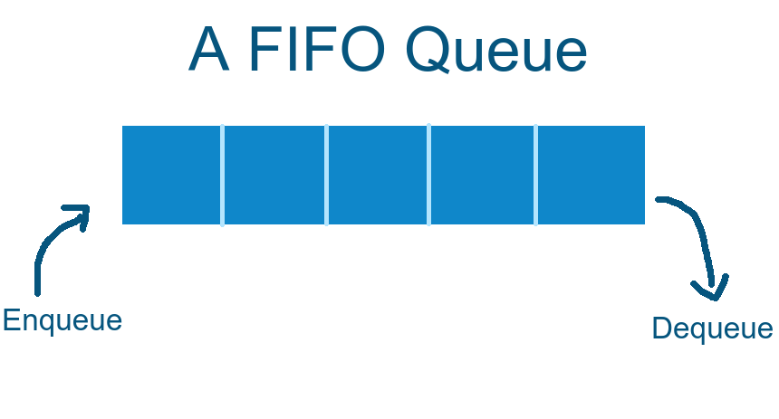

# Kuyruk(Queue)



Kuyruk, ilk giren ilk çıkar (FIFO(first in first out)) ilkesine dayanan bir veri yapısıdır. Bu veri yapısı, verilerin belirli bir sıraya göre işlenmesi gereken uygulamalarda kullanılır. Kuyruk veri yapısı, ekleme, kaldırma ve kuyrukta bulunan en eski elemente erişim işlevlerini içerir. Kuyruğa yeni bir element eklenirken, bu element kuyruğun sonuna eklenir. Kuyruktan eleman çıkartırken ise, kuyruğun başındaki eleman çıkartılır. Kuyruğun doğası gereği, yalnızca kuyruğun başındaki elemana doğrudan erişime izin verir. Kuyruk veri yapısı, işlem sırasına göre verilerin işlenmesi gereken uygulamalar için kullanılabilicek seçeneklerden birisidir. Örneğin bir web sunucusundaki taleplerin işlenmesi için kullanılabilir. Diziler ve Bağlı Listeler, kuyruk veri yapısının gerçeklenmesinde sık kullanılan yöntemlerdir.

| İşlev                | $Big-O$ |
| -------------------- | ------- |
| Ekleme               | $O(1)$  |
| Kaldırma             | $O(1)$  |
| Tepe Değere Erişim   | $O(1)$  |
| Boyut                | $O(1)$  |
| Baş Düğüme Erişim    | $O(1)$  |
| Kuyruk Düğüme Erişim | $O(1)$  |

---

#### Queue Sınıf Yapısı

Bu sınıf bir Queue veri yapısının Bağlantılı Listeler ile uygulamasını göstererir. Yapının sadece baş ve kuyruk adresine doğrudan erişim vardır.

```cpp
template <typename T>
struct Node {
  T data;
  Node<T> *next;
  Node<T> *prev;
  Node(T _data) : data(_data), next(nullptr), prev(nullptr) {}
};

template <typename T>
class Queue {
 public:
  Queue();
  void push(const T value);
  void pop();
  const std::optional<T> front() const;
  const std::optional<T> back() const;
  std::size_t size() const;
  bool empty() const;
  ~Queue();

 private:
  Node<T> *head;
  Node<T> *tail;
  std::size_t m_size;
};
```
---

#### Ekleme 

Listenin başına yeni bir element ekler. Burada karşımıza iki farklı seçenek çıkar, gerçeklenmesinde Dizi mi yoksa Bağlı liste mi?:

- Dinamik bellek yönetimi: Bağlı liste yapısı, elemanların eklenmesi ve çıkarılması için dinamik bellek yönetimi yapar ve bu nedenle daha verimli bellek kullanımına izin verir.
- Ekleme ve çıkarma işlemlerinin hızı: Bağlı liste yapısı, elemanların eklenmesi ve çıkarılması için daha az işlem yapar. Bu nedenle, Queue veri yapısının bağlı liste yapısı, daha hızlı ekleme ve çıkarma işlemleri için daha uygundur. Bağlı Liste için $Big-O(1)$ iken Diziler için $Big-O(n)$ `dir çünkü Dizilerde element kaldırma işlevi ayrıca elementlerin her defasında kaydırılması anlamına gelir(Bu durumun dezavantajını en aza indiricek uygulamalarda vardır).
- Bu durumda Dizileri kullanmanın en büyük faydası, işaretçileri kullanamdığı için bellek maliyetinin en aza indirilmesini sağlar.

```cpp
template <typename T>
void Queue<T>::push(const T value) {
  Node<T> *temp = new Node<T>(value);
  if (!head) {
    head = temp;
    tail = head;
  } else if (head == tail) {
    head->next = temp;
    tail = head->next;
    tail->prev = head;
  } else {
    tail->next = temp;
    temp->prev = tail;
    tail = tail->next;
  }
  m_size++;
}
```

---

#### Kaldırma

Mevcut ilk öğeyi kaldırır.

```cpp
template <typename T>
void Queue<T>::pop() {
  if (head == nullptr)
    return;
  else if (head->next == nullptr) {
    delete head;
    head = nullptr;
  } else {
    head = head->next;
    delete head->prev;
    head->prev = nullptr;
  }
  m_size--;
}
```

<h4 align="center"><a href="/stack">< Önceki Sayfa | <a href="/tree">Sonraki Sayfa ></a></a></h4>